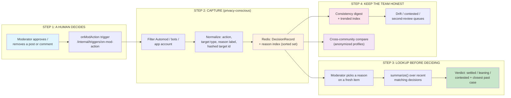
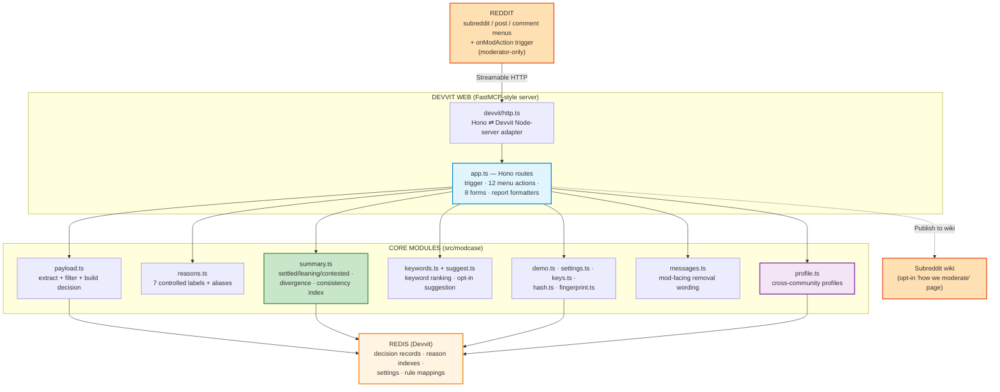
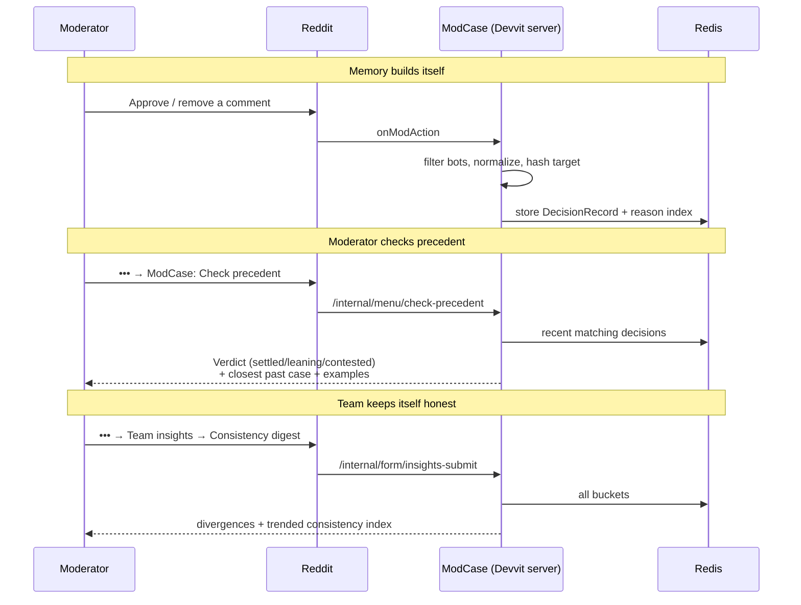

# ModCase — A Consistency Layer for Reddit Moderation

[](https://www.typescriptlang.org/)
[](https://developers.reddit.com/)
[](https://developers.reddit.com/docs/capabilities/devvit-web/devvit_web_configuration)
[](https://hono.dev/)
[](https://developers.reddit.com/docs/capabilities/redis)
[](https://vitest.dev/)
[](https://mod-tools-migration.devpost.com/)
[](https://opensource.org/licenses/MIT)

> **Most moderation tools remember users. ModCase remembers decisions.**
> ModCase doesn't judge content, score users, or take enforcement actions. It gives a moderation team its own institutional memory — and surfaces it at the moment someone is about to decide.

ModCase is a Reddit Developer Platform (Devvit Web) mod tool that automatically captures a team's human approve/remove decisions, stores them as privacy-conscious records in Redis, and turns them into a living answer to one question: **"How has our team handled this kind of case before?"** It shows a settled / leaning / contested verdict before a moderator acts, flags when recent decisions drift from the team's own norm, and never stores a moderator name, an author name, or a user dossier.

## Quick Highlights

- **One idea, not a kitchen sink** — capture decisions, surface precedent, keep the team consistent. Not an AI moderator, not a user-risk scanner, not another note generator.
- **Builds itself with zero extra work** — an `onModAction` trigger captures every human approve/remove; the precedent fills in automatically as the team moderates.
- **Verdict-first lookup** — pick a reason on a fresh post/comment and ModCase leads with *settled / leaning / contested*, backed by counts, recent trend, the closest past case, and example snippets.
- **Hybrid by design, AI-optional** — the safety-relevant signals are **deterministic** (transparent thresholds over stored decisions). A keyword heuristic is the only "smart" assist, and it is opt-in and off by default. No black-box model ever decides whether a rule is settled.
- **Decisions, not people** — hashed target ids, controlled reason labels, aggregate team-level reports. No moderator names, no author names, no per-moderator tracking, no automatic enforcement.
- **12 moderator actions + 12 team-insight reports** — one consolidated *Team insights* picker keeps the surface clean while exposing the full depth.
- **Privacy-safe demo data** — a one-click seeder (and a matching wiper) lets judges see the full loop instantly; demo records are tagged `demo_seed` and never mixed with real captured decisions.
- **68 tests, strict TypeScript, config-verified** — every normalizer, summary rule, and route is covered; `npm run check` gates config + types + tests.

## Live Deployment

| Surface | Where | Notes |
|---|---|---|
| **App listing** | https://developers.reddit.com/apps/modcase-v1 | Published to the Reddit Developer Platform |
| **Live test subreddit** | `r/modcase_v1_dev` | App installed and running; seed demo data to explore |
| **Category** | Best New Mod Tool | Reddit Mod Tools and Migrated Apps Hackathon |

Installed via `devvit upload` → `devvit install r/<subreddit>`. All moderator-facing actions are gated to `forUserType: "moderator"`; raw debug-payload capture is **off** for the published build.

## Architecture Overview

### High-Level Workflow



### System Architecture



### Tech Stack

| Layer | Technology | Purpose |
|---|---|---|
| **Platform** | Reddit Developer Platform (Devvit Web) | Menus, forms, `onModAction` trigger, install model |
| **Runtime** | TypeScript (ESM), Node 22+ | Strict-typed; all route handlers are `async` |
| **Web framework** | Hono 4 | Routes the trigger, 12 menu actions, and 8 forms behind one Devvit server |
| **Decision engine** | Deterministic rules (`summary.ts`) | Settled/leaning/contested, divergence, consistency index — no model in the safety path |
| **"Smart" assist** | Keyword heuristics (`keywords.ts`, `suggest.ts`) | Example ranking + **opt-in, off-by-default** reason suggestion; never AI classification |
| **Storage** | Redis (Devvit) | `DecisionRecord`s, reason indexes (sorted sets), settings, rule mappings |
| **Privacy** | `hash.ts` + `fingerprint.ts` | Salted target hashes and a content fingerprint — never raw ids or bodies as keys |
| **Build** | Vite | Bundles the Devvit server to `dist/server/index.cjs` |
| **Lint / Type** | `tsc --noEmit` (strict) + config verifier | `scripts/verify-devvit-config.mjs` guards the Devvit contract |
| **Testing** | Vitest (68 tests) | Unit (normalizers, summary, profile, suggest, messages) + route-level with an in-memory Redis |
| **Deploy** | `devvit upload` → developer.reddit.com | One server serves the trigger + every menu/form |
| **Package mgmt** | npm | Reproducible installs from `package.json` |

## The Problem

The most common source of moderator–community friction on Reddit isn't a single bad call — it's **inconsistency**. On any active subreddit:

- Multiple moderators review the same kinds of reports and quietly disagree on the borderline ones ("harassment" vs "heated debate," "low-effort" vs "fine").
- "Why was my comment removed when an identical one is still up?" is one of the most corrosive things a community can experience, and it's almost always a consistency gap, not a rules gap.
- Mod teams **rotate**. When a veteran leaves, their judgment leaves with them — the unwritten norms are not written down anywhere.
- AI is about to make this worse: agents will generate moderation recommendations at far higher volume while the human capacity to keep them consistent stays flat.

Most tooling remembers **users** (ban history, risk scores). Almost nothing remembers **how the team decides** — so every moderator re-derives the norm from scratch, and the norm silently drifts.

## The Solution

ModCase is the layer that sits between a report and a decision:

- **Every human approve/remove is captured automatically** and normalized into a privacy-conscious `DecisionRecord` (subreddit, content type, controlled reason, hashed target, timestamp, optional snippet).
- **Precedent is surfaced at decision time** — a moderator picks the reason on a fresh item and sees the team's verdict (*settled / leaning / contested*), the closest past case, and recent examples, with a minimum-sample guard so it never overclaims on thin history.
- **Drift is made visible** — the consistency digest and trended index show how often recent decisions went *against* the team's own settled norm, turning silent disagreement into a prompt for a policy conversation.
- **Knowledge survives turnover** — a living community constitution, a calibration mode for onboarding, and an opt-in wiki page encode "how we moderate here" so new mods inherit it.

The moderator always makes the call. ModCase only ensures they can see the team's memory first.

## The Core Logic (transparent rules, no black-box model)

### Signal Classification

`summarize()` derives the verdict from recent matching decisions only — never a model:

| Condition | `signal` | Shown as |
|---|---|---|
| `total < 5` | `limited_history` | "Limited history — showing counts only, no norm inferred yet" |
| majority share `>= 0.80` | `settled` | "Settled team pattern: N% \<action\>" |
| `0.60 <= share < 0.80` | `leaning` | "Leaning pattern: N% \<action\>, but not fully settled" |
| share `< 0.60` | `contested` | "Contested rule: the team is split" |

### Divergence (the consistency digest)

Walking a bucket's decisions oldest → newest, a decision counts as **against precedent** when, *at the time it was made*, the prior decisions already formed a leaning-or-settled majority (`>= 60%`, with at least 5 prior samples) and it took the opposite action. Derived from stored records — no capture-time flags, so it works on demo data too.

### Trended Consistency Index

```
index(window) = decisions_in_window_that_followed_the_norm
              / decisions_in_window_made_once_a_norm_existed
```

Reported as **this week vs previous week**, so a team can see consistency improving or slipping.

### Cross-Community Comparison (k-anonymous, no backend)

A subreddit exports an aggregate **community profile** — per reason/content-type bucket counts and majority action, **only for buckets with `>= 5` decisions** — that another moderator pastes in to compare norms. No usernames, no content, no shared database; the minimum-sample floor is k-anonymity on bucket size.

## Features

### 12 Moderator Actions

| # | Action | Surface | What it does |
|---|---|---|---|
| 1 | **Check precedent** | post / comment | Pick a reason → verdict-first precedent panel + closest past case |
| 2 | **Record correction** | post / comment | Log a decision (with an optional internal note) without acting on Reddit |
| 3 | **Team insights** | subreddit | One picker → 12 aggregate reports (below) |
| 4 | **Compare community** | subreddit | Paste another community's anonymized profile to compare norms |
| 5 | **Sync rules** | subreddit | Import the subreddit's rules into controlled reason labels |
| 6 | **Unknown cleanup** | subreddit | Remap "unknown reason" records into a real label |
| 7 | **Training mode** | subreddit | Multi-case calibration quiz with an **ephemeral** score (never stored per-mod) |
| 8 | **Settings** | subreddit | Retention (30/90/180/365d), lookup cap (25/50/100), opt-in reason suggestion |
| 9 | **Seed demo data** | subreddit | Populate realistic demo history for evaluation |
| 10 | **Clear demo data** | subreddit | Delete only the seeded records — real captured decisions untouched |
| 11 | **Publish to wiki** | subreddit | Post a living "how we moderate" page to the subreddit wiki |
| 12 | **Debug log count** | subreddit | Verification helper (raw capture off in production) |

### 12 Team-Insight Reports (one picker)

`Consistency digest` (with trended index) · `Rule health` · `Rule trends` · `Contested rules` · `Second review` · `Rule drift` · `Community constitution` · `Transparency summary` · `Audit snapshot` · `Export report` · `Export community profile` · `Removal message guide`

### Privacy Posture (cross-cutting)

| ModCase does | ModCase never does |
|---|---|
| Stores decisions (hashed target, reason label) | Stores moderator or author names |
| Reports at the **team** level, in aggregate | Tracks or scores individual moderators |
| Surfaces precedent for a human to weigh | Auto-removes, auto-approves, or messages users |
| Uses deterministic rules for every verdict | Lets a model decide whether a rule is settled |

## Demo Flow

Install on a test subreddit, then run the loop from the menus:

```
1. Subreddit ••• → ModCase: Seed demo data          → "Seeded 12 demo decisions"
2. A comment ••• → ModCase: Check precedent
     → pick "Harassment / Abuse"                     → "Leaning pattern: 75% removed" + examples
3. Subreddit ••• → ModCase: Team insights
     → Consistency digest                            → "1 decision went against settled precedent"
4. Subreddit ••• → ModCase: Team insights
     → Export community profile                      → copyable anonymized profile
5. Subreddit ••• → ModCase: Compare community
     → paste another profile                         → "you removed 75%, r/other approved 78% — differ"
6. Subreddit ••• → ModCase: Clear demo data          → back to a clean, real-only slate
```

The money shot is step 2 → step 3: the panel proves the team *leans remove*, and the digest catches the single decision that broke from that norm — institutional memory working, on screen.

### Tool-Call Sequence



## Project Structure

```
reddit/
├── src/
│   ├── index.ts                 # Devvit server entry (createServer + listen)
│   ├── app.ts                   # Hono routes: trigger, 12 menu actions, 8 forms, report formatters
│   ├── devvit/http.ts           # Hono ⇄ Devvit Node-server adapter
│   └── modcase/
│       ├── payload.ts           # onModAction extraction, bot/app filtering, decision construction
│       ├── reasons.ts           # 7 controlled reason labels + alias normalization
│       ├── summary.ts           # settled/leaning/contested, divergence, consistency index, panel
│       ├── keywords.ts          # keyword overlap + example ranking
│       ├── suggest.ts           # opt-in keyword reason suggestion (off by default)
│       ├── profile.ts           # community profile build / encode / parse / compare (k-anonymous)
│       ├── messages.ts          # mod-facing removal-message wording
│       ├── fingerprint.ts       # privacy-safe content fingerprint
│       ├── hash.ts              # stable hash + id helpers
│       ├── keys.ts              # Redis key builders
│       ├── settings.ts          # bounded retention/lookup + opt-in toggle
│       ├── demo.ts              # demo seed records (HTEST-equivalent: source = demo_seed)
│       └── types.ts             # shared domain types
├── tests/                       # 68 Vitest tests (payload, reasons, summary, suggest, profile, messages, routes, devvit-config)
├── devvit.json                  # menus (12), forms (8), onModAction trigger, permissions
├── docs/                        # ARCHITECTURE, DECISIONS, product, plans, submission
├── scripts/verify-devvit-config.mjs   # Devvit config contract check
├── package.json · vite.config.ts · vitest.config.ts · tsconfig.json
└── Makefile                     # setup / check / build / playtest
```

## Configuration

ModCase needs no secrets to run — there is no external API in the runtime path. Behavior is configured per-subreddit in the **Settings** menu and via Devvit:

```jsonc
// devvit.json (excerpt)
{
  "name": "modcase-v1",
  "triggers": { "onModAction": "/internal/triggers/on-mod-action" },
  "permissions": { "reddit": true, "redis": true }
}
```

| Setting | Where | Values |
|---|---|---|
| Decision retention | Settings menu | 30 / 90 / 180 / 365 days |
| Lookup history cap | Settings menu | 25 / 50 / 100 recent matches |
| Reason suggestion | Settings menu | Off (default) / On — opt-in keyword assist |
| Raw debug capture | `src/index.ts` | `captureRawPayloadsForDebug: false` for production |

## Quick Start

### Prerequisites

- Node 22+ and npm 10+
- Devvit CLI auth for a Reddit developer account (for playtest / upload)

### Install & verify

```bash
git clone https://github.com/ankitlade12/Modcase.git
cd Modcase
npm install
npm run check        # config verify + tsc (strict) + 68 Vitest tests
npm run build        # bundle the Devvit server
```

### Playtest, then publish

```bash
npm run dev                      # devvit playtest (creates / uses a dev subreddit)
npx devvit upload                # publish to developer.reddit.com
npx devvit install r/<your_sub>  # install on a subreddit you moderate
```

In the subreddit, seed demo data and run the [demo flow](#demo-flow) above.

### Reproducible testing

```bash
npm test                         # 68 tests
npm run typecheck                # tsc --noEmit (strict)
npm run verify:config            # Devvit config contract
make check                       # lint + tests (matches the gate)
```

## Hackathon Innovation

### Why ModCase Stands Out

1. **Consistency, not generation.** Most entries *produce* something — summaries, triage, auto-replies. ModCase remembers how a team *decides* and surfaces it at the decision. It's the horizontal primitive a community keeps, not a one-shot output.
2. **Deterministic where it matters, AI only where it's safe.** Every verdict is a transparent function of stored decisions. The single "smart" feature is a keyword heuristic that is opt-in and off by default — so the default product makes no classification claims it can't defend.
3. **Privacy as the product, not a disclaimer.** Decisions, not people: hashed targets, controlled labels, aggregate reports, k-anonymous cross-community profiles. There is no surface that scores or tracks an individual.
4. **Derive, don't store.** Divergence and the consistency index are computed from the same decision records at read time (no extra schema, no counters), which is why the demo seeder lights them up instantly and retries can't corrupt them.
5. **Honest about the platform.** Cross-community comparison ships as exportable profiles because Devvit storage is per-install; the wiki publish is a mod action because the scheduler is unverified. Each is the real, shippable form of the idea — clearly labeled, never faked.

### The Gap We Fill

| Capability | Typical mod tool | ModCase |
|---|---|---|
| Remembers | Users (bans, risk) | **Decisions** (the team's norm) |
| Output | An action or a score | A *verdict* + visible drift, for a human to weigh |
| Decision authority | Often automated | None — surfaces precedent only |
| Privacy | User histories / dossiers | Hashed targets, aggregate, no per-mod tracking |
| When teams rotate | Knowledge leaves | Constitution + calibration keep the norm |

## Future Enhancements

- **Scheduled wiki refresh** — the "how we moderate" page is a mod action today; a Devvit scheduler would keep it current automatically (one config addition, same primitive).
- **Cross-install precedent network** — if the platform exposes a shared store, the export/paste profiles become a live, opt-in, k-anonymous network — no code changes to the comparison logic.
- **Richer reason taxonomies** — community-defined controlled labels on top of the existing alias normalizer.
- **Decision-time removal wording** — surface the removal-message guide inline (opt-in) at the moment of removal, not just as a reference.
- **Durable storage + retention** — the in-memory-shaped Redis model is serialization-ready; production retention/analytics is substitution, not a rewrite.

## License

[MIT](./LICENSE) — permissive; the Reddit Mod Tools and Migrated Apps Hackathon does not mandate a specific license.

---

**Built for the Reddit Mod Tools and Migrated Apps Hackathon — Best New Mod Tool** (Devpost, deadline 2026-05-27). Submission path: a Devvit Web app published to developer.reddit.com.

*"Before I decide, show me how our team usually handles this."* — ModCase remembers decisions, so the team stays consistent without remembering people.
